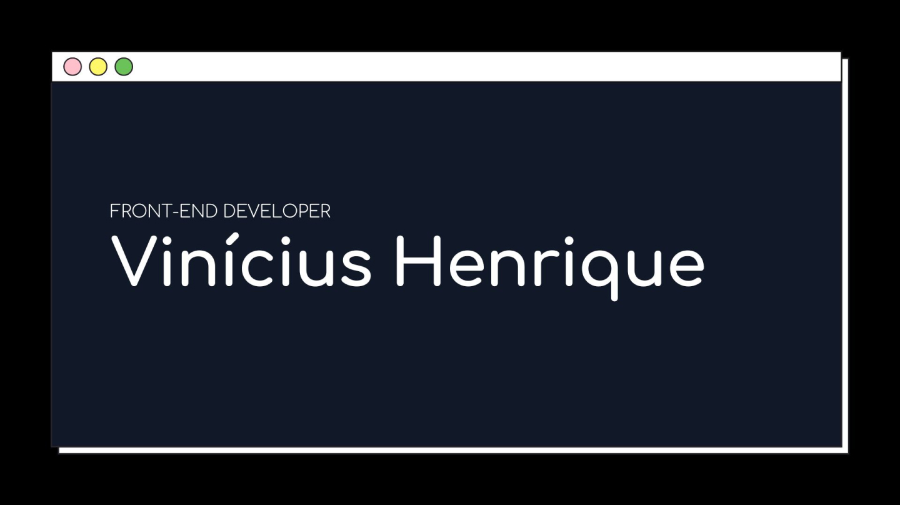

# Hello welcome! feel free to read my codes 🤯

<!---->

<a href="mailto:viniciush2015@gmail.com" target="_blank" display='inline'>
 </img>
</a>

<a href="https://www.linkedin.com/in/vinícius-henrique-7a2533229/" target="_blank">
</img>
</a>
 

## A little about myself 👋

I'm a front end developer in constant evolution, I live in Brazil, Belo Horizonte-MG, my skills at the moment are HTML, CSS/SCSS and JavaScript, in my projects I like to focus on accessibility, performance and responsiveness.

- ❤️ I love turning layouts into codes

- 📖 I enjoy reading articles to stay updated and other people's codes.

- 👨‍💻 I practice my skills on the website <a href="https://www.frontendmentor.io/challenges">Frontend Mentor</a>

- 🚀 I want to create content to help the community

## 🛠️ Technical Skills & Tools

- [HTML](https://developer.mozilla.org/en-US/docs/Web/html) - The building block of the web.
- [CSS](https://developer.mozilla.org/en-US/docs/Web/css) - The styling language for the web.
- [Sass](https://sass-lang.com/) - CSS pre-processor.
- [JavaScript](https://developer.mozilla.org/en-US/docs/Web/javascript) - Programming language for the web browsers.
- [Git](https://git-scm.com/) - Track the history of my projects.
- [Figma](https://www.figma.com/) - Design tool. I use Figma when I am working with a design file. Of course, I am not a designer.
- [Visual Studio Code](https://code.visualstudio.com/) - Code editor.

## 📚 Currently studying

- Improving myself even more [JavaScript]()

## 🏆 Some of my projects

<!-- Repo info cards - https://github.com/anuraghazra/github-readme-stats -->
<!-- Small repo cards (fork) - https://github.com/DenverCoder1/github-readme-stats -->

  
  
  
  
  
  
  
  
  

## 🚧 I'm currently working on

I'm working on a project called <a href="https://www.frontendmentor.io/challenges/github-user-search-app-Q09YOgaH6" target="_blank" >GitHub user search app
</a>, <a href="https://www.frontendmentor.io/challenges/dine-restaurant-website-yAt7Vvxt7" target="_blank">Dine restaurant website</a>
## What about Some Statistics? :bar_chart:

View my activity on GitHub

